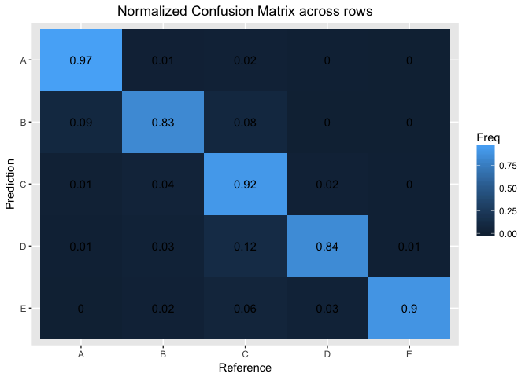

## FitBit Motion Sensor Activity
E. Urdiales  

## Executive Summary
The puropse of this assignment is to determine whether six participants executed a barbell
lift correctly. Sensors were placed on different areas of the body and dumbell and measurements
were recorded. There are correct and incorrect ways to do the exercise and based on the 
measurements, we can determine rather accurately if the movement was done correctly. According 
to my algorithm, an out of sample accuracy of 89.98% was acheived (out of sample error 
of 10%). We then used this algorthm to predict 20 test cases. An accuracy of 90% was 
recorded for the final test data.


```r
url_train <- "https://d396qusza40orc.cloudfront.net/predmachlearn/pml-training.csv"
download.file(url_train, "HAR_Data.csv")
HAR_data <- read.csv("HAR_data.csv", stringsAsFactors = FALSE)
```

## Data Cleaning
By inspection, there are 100 variables that have very sparse data. The only entries that
have values correspond to when the variable `new_window` has value `yes`. Since the test data has 
this variable as `no`, we disregard all rows where the `new window` varibale is `yes`. There are
two main reasons for doing this. The first was already mentioned. The second reason is that the
observations have unreliable data as indicated by entries that have special characters (@, !, etc.).


```r
HAR_data <- filter(HAR_data, new_window == "no")
bad_ind <- apply(HAR_data, 2, function(x){all(is.na(x)) | all(x == "")})
bad_ind <- as.vector(bad_ind)
HAR_data <- HAR_data[, !bad_ind]
dim(HAR_data)
```

```
## [1] 19216    60
```

Variables that do not affect any of the sensor measurements such as person's name, time measurement 
was taken, etc. are deleted. These are the first 7 columns. 


```r
HAR_data <- HAR_data[, 8:ncol(HAR_data)]
HAR_data$classe <- as.factor(HAR_data$classe)
```

## Cross Validation, Preprocessing, and Model Selection
The cross validation was done by using *random subsampling*. The training data consisted of 
75% of the samples and by default, the testing data contained 25% of the samples. 


```r
set.seed(6358)
inTrain <- createDataPartition(y = HAR_data$classe, p = 0.75, list = FALSE)
training <- HAR_data[inTrain, ]
testing <- HAR_data[-inTrain, ]
set.seed(3579)
```

I decided to do a principal component analysis (PCA) because there were 53 variables and for 
efficiency purposes, I wanted to use less variables. I chose to capture 90% of the variation 
within the data to maintain accuracy while avoiding overfitting. Only 18 principal components 
were needed to capture 90% of the data. I used a boosting algorithm and the running time was 
several hours so I decided to fit a support vector machine instead. The running time was 
reduced dramatically to only about 15 seconds.


```r
preProc <- preProcess(training, method = "pca", thresh = 0.9)
trainingPC <- predict(preProc, training)
testingPC <- predict(preProc, testing)

# time code
t0 <- proc.time()
model_svm <- svm(classe ~ ., data = trainingPC)
proc.time() - t0
```

```
##    user  system elapsed 
##  15.156   0.101  15.273
```

```r
model_predict <- predict(model_svm, testingPC)
confusionMat <- confusionMatrix(testing$classe, model_predict)
confusionMat$overall
```

```
##       Accuracy          Kappa  AccuracyLower  AccuracyUpper   AccuracyNull 
##   8.998334e-01   8.731363e-01   8.909932e-01   9.081839e-01   2.961266e-01 
## AccuracyPValue  McnemarPValue 
##   0.000000e+00   1.863777e-39
```


```r
M <- confusionMat$table
M <- M/apply(M, 1, sum)
M <- as.data.frame(M)

g <- ggplot(M, aes(x = Reference, y = Prediction))
g <- g + geom_tile(aes(fill = Freq)) + geom_text(aes(label = round(Freq, 2))) + 
    scale_y_discrete(limits = rev(levels(M$Reference))) + 
    labs(title = "Normalized Confusion Matrix across rows") + 
    theme(plot.title = element_text(hjust = 0.5))
```


```r
g
```



## Conclusion

It is important to note that although boosting provided a much better estimate for the out of
sample error (~1%), I wanted to avoid overfitting. The estimated out of sample error (~11%)
most likely reduces the error on the test data. It is important to note that activities
executed exactly according to specification were denoted by class A. A near perfect execution
of the movement was recorded 96.78% of the time. 


## Appendix: Test Data

```r
test_data <- read.csv("pml-testing.csv", stringsAsFactors = FALSE)
bad_test_ind <- apply(test_data, 2, function(x){all(is.na(x)) | all(x == "")})
bad_test_ind <- as.vector(bad_test_ind)
test_data <- test_data[, !bad_test_ind]
test_data <- test_data[, 8:ncol(test_data)]
test_data_pca <- predict(preProc, test_data[-53])
test_predict <- predict(model_svm, test_data_pca)
```
